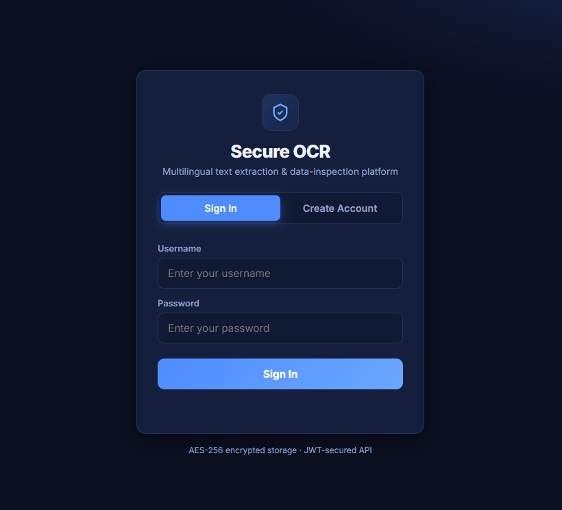
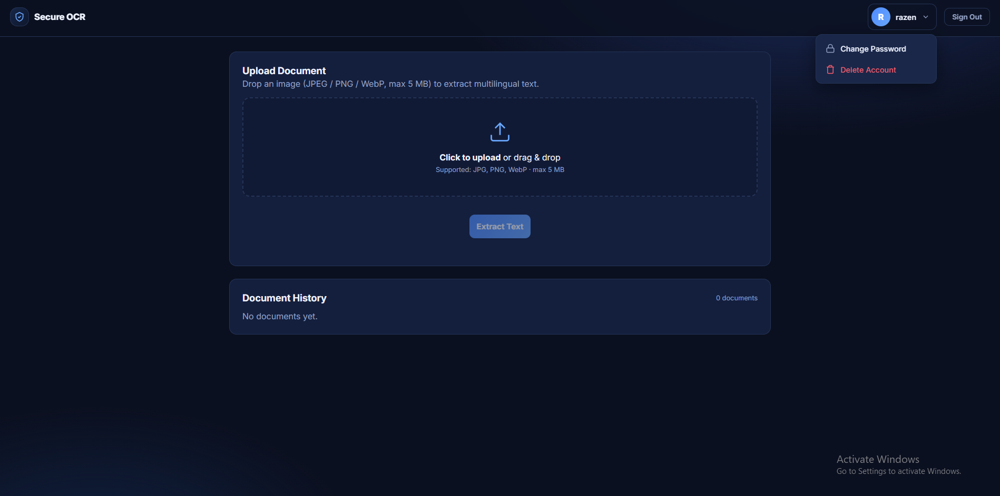
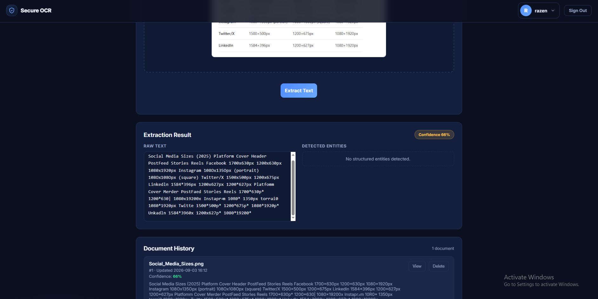

# 🔐 Secure Multilingual OCR & Data Extraction Platform

> Snap a photo of an invoice, an ID, a receipt — get clean text + structured data back.
> In English **and** Arabic. Encrypted. Authenticated. With a UI that doesn't hurt your eyes. 📸➡️📊


## ✨ What is this?

A production-style OCR service that reads **English + Arabic** documents, pulls out the stuff you actually care about (invoice numbers, emails, phones, dates, national IDs), and stores everything **AES-encrypted** behind **JWT auth** — wrapped in a dark-themed web UI.

| Capability | Details |
|---|---|
| 🌍 Multilingual OCR | EasyOCR with `en` + `ar` out of the box |
| 🧠 Smarter detection | OpenCV preprocessing (denoise → CLAHE → deskew → binarize) + 3-variant ensemble merge |
| 🔤 Arabic-Indic digits | `٢٩٨٠٨١٢٣٤٥٦٧٨٩` auto-normalized so entity patterns just work |
| ✉️ OCR-proof entities | Reassembles split emails like `ops @company com` → `ops@company.com` |
| ⚠️ Review flag | Low-confidence results get flagged instead of silently trusted |
| 🔐 Security | JWT, bcrypt, Fernet encryption at rest, 5 MB cap, injection sanitization |
| 🖥️ Web UI | Auth tabs, drag-&-drop upload, confidence badges, document history |

## 📷 Screenshots

> Screenshots live in [`docs/`](docs/SCREENSHOTS.md) — drop your own PNGs there and they'll show up here.

| Sign in | Dashboard | Results |
|---|---|---|
|  |  |  |

## ⚡ Try it in 60 seconds

1. `pip install -r requirements.txt` then `python -X utf8 app.py`
2. Open **http://127.0.0.1:5000** → create an account
3. Drag & drop an invoice photo → watch entities pop out 🎉

No server? No problem — run the pure-engine self-test (no Flask needed):

```bash
python -X utf8 ocr_engine.py
```

## 🔍 Sample output

A noisy scan containing `Invoice id: INV-2026-99X` + `Contact ops @company com` comes back as:

```json
{
  "document_id": 1,
  "raw_text": "Invoice id: INV-2026-99X Contact ops @company com ...",
  "structured_entities": {
    "invoice_id": "INV-2026-99X",
    "contact_email": "ops@company.com",
    "phone_number": "+20 106 126 2479",
    "date": "12/05/2025"
  },
  "average_confidence": 0.8872,
  "review_warning": false
}
```

Low confidence? You'll get `"review_warning": true` plus a ⚠️ banner in the UI — go double-check that scan.

## 🛠️ Tech stack

| Layer | Tech | Why |
|---|---|---|
| OCR | EasyOCR 1.7.2 | Multilingual incl. Arabic, no training needed |
| Preprocessing | OpenCV + NumPy | Denoise, contrast, deskew, binarize noisy scans |
| API | Flask + Flask-JWT-Extended | Lightweight, JWT-secured routes |
| Auth | bcrypt | Passwords hashed, never recoverable — by design |
| Encryption | Fernet (AES via `cryptography`) | Extracted text encrypted before touching disk |
| Storage | SQLAlchemy (SQLite local) | Swap one URI for `postgresql://` in production |
| Validation | Pydantic | Language codes & OCR response schemas |
| UI | Vanilla HTML/CSS/JS | Dark theme, zero build step |

## 🚀 Quickstart

```bash
cd secure-ocr-platform
python -m venv venv
venv\Scripts\activate        # Windows
pip install -r requirements.txt
python -X utf8 app.py
```

> ⚠️ The `-X utf8` flag matters on Windows: EasyOCR's progress bar prints `█`, which crashes the default cp1252 console. You've been warned (lovingly).

First run downloads the EasyOCR language models (~300 MB) and creates `ocr_platform.db`.

## 📡 API reference

All JSON endpoints live under `/api`. The web UI at `/` already speaks to all of them.

<details>
<summary><b>POST /api/register</b> — create an account</summary>

```bash
curl -X POST http://127.0.0.1:5000/api/register \
  -H "Content-Type: application/json" \
  -d "{\"username\":\"razen\",\"password\":\"secret123\"}"
```
→ `201 {"message": "user created"}`
</details>

<details>
<summary><b>POST /api/login</b> — get your JWT</summary>

```bash
curl -X POST http://127.0.0.1:5000/api/login \
  -H "Content-Type: application/json" \
  -d "{\"username\":\"razen\",\"password\":\"secret123\"}"
```
→ `200 {"access_token": "..."}`
</details>

<details>
<summary><b>POST /api/ocr</b> — upload & extract 🔑 <i>(requires token)</i></summary>

```bash
curl -X POST http://127.0.0.1:5000/api/ocr \
  -H "Authorization: Bearer <TOKEN>" -F "file=@scan.jpg"
```
→ `200` with `raw_text`, `structured_entities`, `average_confidence`, `review_warning`
</details>

<details>
<summary><b>GET /api/documents</b> — list your docs 🔑</summary>

```bash
curl http://127.0.0.1:5000/api/documents -H "Authorization: Bearer <TOKEN>"
```
</details>

<details>
<summary><b>DELETE /api/documents/&lt;id&gt;</b> — delete one doc 🔑</summary>

```bash
curl -X DELETE http://127.0.0.1:5000/api/documents/1 -H "Authorization: Bearer <TOKEN>"
```
</details>

<details>
<summary><b>POST /api/account/change-password</b> 🔑</summary>

```bash
curl -X POST http://127.0.0.1:5000/api/account/change-password \
  -H "Authorization: Bearer <TOKEN>" -H "Content-Type: application/json" \
  -d "{\"old_password\":\"secret123\",\"new_password\":\"newsecret456\"}"
```
</details>

<details>
<summary><b>DELETE /api/account</b> — nuke account + all docs 🔑</summary>

```bash
curl -X DELETE http://127.0.0.1:5000/api/account -H "Authorization: Bearer <TOKEN>"
```
</details>

## 🛡️ Security features

- 🔑 JWT required on every OCR/storage endpoint
- 🔒 bcrypt password hashing (min 6 chars, change-password verifies the old one)
- 🧊 Fernet AES encryption before extracted text touches disk
- 📦 5 MB upload cap (Flask config + in-memory byte check)
- 🖼️ Structural image validation (PIL `verify()` + format whitelist)
- 🧹 Regex sanitization strips `< > { } [ ] \ ^ ` ~` from OCR output
- ✅ Language-code validation (`^[a-z]{2,3}$`) blocks parameter injection
- 📁 `secure_filename` prevents path traversal

> 🔑 **Heads-up:** the encryption key auto-generates per launch unless you set `OCR_ENCRYPTION_KEY`. Restart without it and old docs return `[cannot decrypt]`. Set the env var — future you says thanks.

## 🧩 Extending entities

Open `ocr_engine.py` → add patterns to `DEFAULT_FILES`:

```python
DEFAULT_FILES = {
    'national_id': [r'\b([0-9]{14})\b'],
    'product_code': [r'\b([A-Z]{3}-\d{4})\b'],
    ...
}
```

## 📁 Project structure

```
secure-ocr-platform/
├── app.py               # Flask API: register / login / ocr / documents / account
├── ocr_engine.py        # OCR engine: preprocessing + ensemble + entities
├── models.py            # SQLAlchemy User + DocumentRecord models
├── requirements.txt     # Python dependencies
├── templates/
│   └── index.html       # Web UI shell
├── static/
│   ├── css/style.css    # Dark theme
│   └── js/app.js        # Auth, upload, history, modals
├── docs/
│   └── SCREENSHOTS.md   # How to add screenshots
└── README.md            # You are here 👋
```

## 🗺️ Roadmap

- [ ] PostgreSQL deploy config + Docker image
- [ ] GPU support flag for EasyOCR
- [ ] Pytest suite for entity extraction
- [ ] More languages & entity types
- [ ] Export results as CSV/PDF

## 📄 License

MIT — see [LICENSE](LICENSE). Built by [Razen-ByteMaster](https://github.com) as a portfolio project. PRs welcome! 🎉
